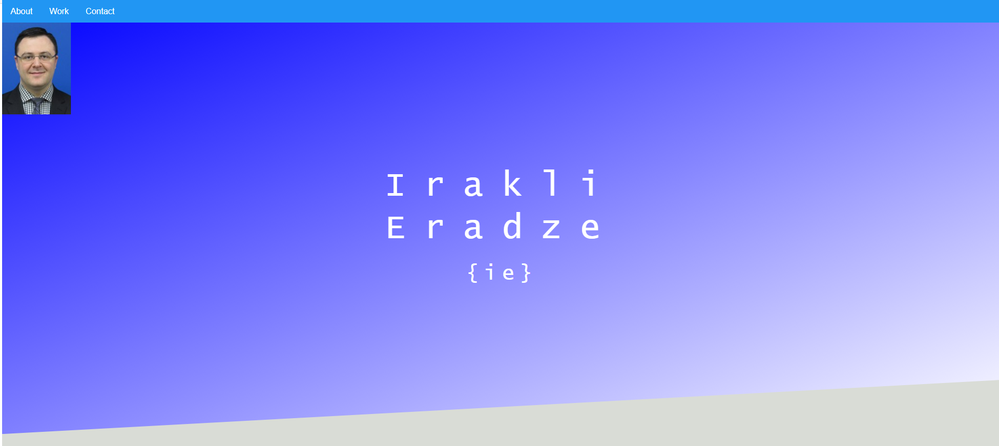
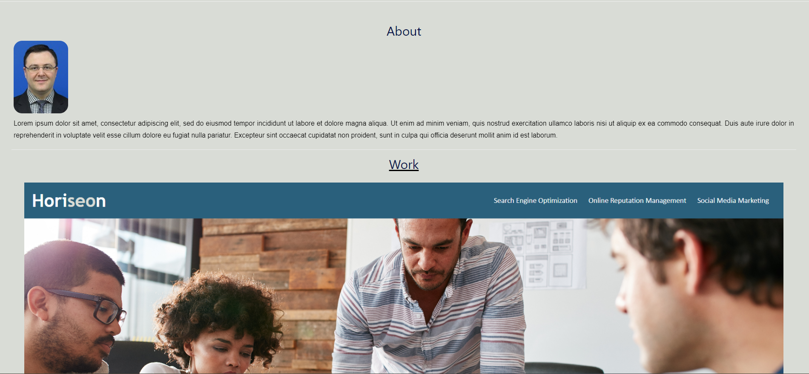
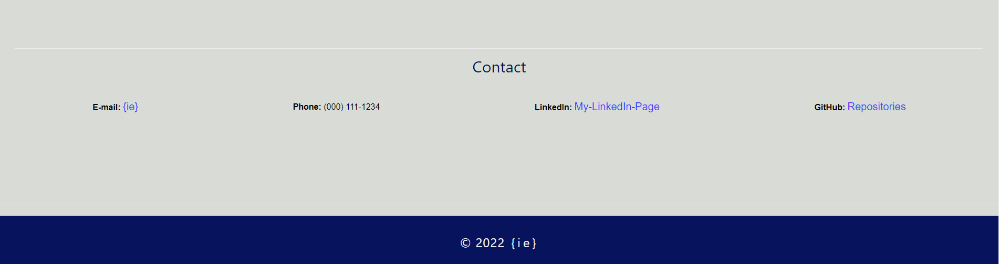

# Module-2-Challenge-Advanced-CSS: Portfolio

## Description 

### User Story

```
AS AN employer
I WANT to view a potential employee's deployed portfolio of work samples
SO THAT I can review samples of their work and assess whether they're a good candidate for an open position
```


### Acceptance Criteria


```
GIVEN I need to sample a potential employee's previous work
WHEN I load their portfolio
THEN I am presented with the developer's name, a recent photo or avatar, and links to sections about them, their work, and how to contact them
WHEN I click one of the links in the navigation
THEN the UI scrolls to the corresponding section
WHEN I click on the link to the section about their work
THEN the UI scrolls to a section with titled images of the developer's applications
WHEN I am presented with the developer's first application
THEN that application's image should be larger in size than the others
WHEN I click on the images of the applications
THEN I am taken to that deployed application
WHEN I resize the page or view the site on various screens and devices
THEN I am presented with a responsive layout that adapts to my viewport
```

### link to deployed application:
https://ikaera.github.io/My-Portfolio-IE/

## Usage 




## Credits 

For the pictures I give credits to www.jw.org.

As far as third-party assets I used:
https://www.w3schools.com/css/css_navbar.asp

I followed tutorials, I include link to it here as well:
https://www.udemy.com/course/advanced-css-and-sass/learn/lecture/8274522?start=28#overview


<!-- Provide a short description explaining the what, why, and how of your project. Use the following questions as a guide:

- What was your motivation?
- Why did you build this project? (Note: the answer is not "Because it was a homework assignment.")
- What problem does it solve?
- What did you learn? -->

<!-- ## Table of Contents (Optional) (n/a)

If your README is long, add a table of contents to make it easy for users to find what they need.

- [Installation](#installation)
- [Usage](#usage)
- [Credits](#credits)
- [License](#license)

## Installation (n/a)

What are the steps required to install your project? Provide a step-by-step description of how to get the development environment running.

## Usage (n/a)

Provide instructions and examples for use. Include screenshots as needed.

To add a screenshot, create an `assets/images` folder in your repository and upload your screenshot to it. Then, using the relative filepath, add it to your README using the following syntax:

    ```md
    
    ```

## Credits 

For the pictures I give credits to www.jw.org.

List your collaborators, if any, with links to their GitHub profiles.

If you used any third-party assets that require attribution, list the creators with links to their primary web presence in this section:
https://www.w3schools.com/css/css_navbar.asp

I followed tutorials, I include links to those here as well:
https://www.udemy.com/course/advanced-css-and-sass/learn/lecture/8274522?start=28#overview

## License (n/a)

The last section of a high-quality README file is the license. This lets other developers know what they can and cannot do with your project. If you need help choosing a license, refer to [https://choosealicense.com/](https://choosealicense.com/).

---

🏆 The previous sections are the bare minimum, and your project will ultimately determine the content of this document. You might also want to consider adding the following sections.

## Badges (n/a)


Badges aren't necessary, per se, but they demonstrate street cred. Badges let other developers know that you know what you're doing. Check out the badges hosted by [shields.io](https://shields.io/). You may not understand what they all represent now, but you will in time.

## Features (n/a)

If your project has a lot of features, list them here.

## How to Contribute (n/a)

If you created an application or package and would like other developers to contribute it, you can include guidelines for how to do so. The [Contributor Covenant](https://www.contributor-covenant.org/) is an industry standard, but you can always write your own if you'd prefer.

## Tests (n/a)

Go the extra mile and write tests for your application. Then provide examples on how to run them here. -->